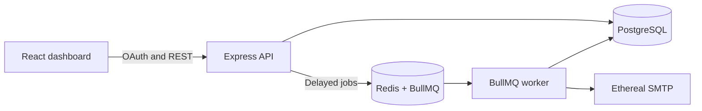

# ReachInbox Email Scheduler

Full-stack delayed email scheduler built for the Outbox Labs hiring assignment. It accepts bulk recipients, persists every email in PostgreSQL, schedules durable BullMQ jobs in Redis, sends through Ethereal SMTP, and shows scheduled/sent state in a React dashboard.

## Features

### Backend

- Express + TypeScript API with real Google OAuth 2.0
- Redis-backed, HttpOnly login sessions
- PostgreSQL/Prisma source of truth for users, campaigns, jobs, and attachments
- BullMQ delayed jobs without cron or polling schedulers
- Separate API and worker processes with graceful shutdown
- Configurable worker concurrency and per-sender hourly limits
- Atomic Redis Lua limiter shared by all worker instances
- Configurable minimum delay between sends
- Deterministic queue IDs, conditional DB claims, and startup reconciliation
- SMTP error classification with bounded timeouts and fail-fast permanent failures
- Multiple environment-configured Ethereal senders
- Rich HTML sanitization and attachment validation (5 files, 10 MB total)
- Health endpoints at `/health/live` and `/health/ready`
- Correlated API responses and logs through `X-Request-Id`

### Frontend

- React, Vite, TypeScript, Tailwind CSS, and TanStack Query
- Google-only login and authenticated user profile/logout
- Figma-aligned Scheduled and Sent views with search, loading, error, and empty states
- Rich-text compose editor
- Manual recipient chips and CSV/TXT lead-list parsing with deduplication
- Sender, start time, delay, hourly limit, and attachment controls
- Responsive desktop/mobile layout

## Architecture



PostgreSQL owns business state and audit history. Redis owns delayed queue state, sessions, and distributed throttle reservations. API creates campaign and recipient rows first, then bulk-enqueues deterministic BullMQ IDs. On process startup, worker reconciles all pending/queued DB rows against Redis and restores missing jobs. Already-sent rows are never rebuilt.

Recipient `n` initially runs at:

```text
startAt + n * max(campaignDelay, MIN_SEND_INTERVAL_MS)
```

At execution time, one atomic Lua script reserves both sender and campaign hourly capacity plus sender's next-send timestamp. If no slot exists, worker moves job to exact next eligible timestamp. Jobs are delayed, never dropped. With 1,000 jobs and a 200/hour limit, queue drains across roughly five hourly windows while configured concurrency remains useful for multiple senders and SMTP latency.

## Prerequisites (No Docker Required)

- Node.js 22 or newer
- pnpm 11 (`npm install -g pnpm@11.2.2`)
- PostgreSQL 16+ in WSL2, natively on Windows, or from a managed provider
- Redis 7+ in WSL2, or a TLS-enabled hosted Redis provider

Docker is not required. Docker Desktop licensing has no effect on this setup.

### PostgreSQL

Install PostgreSQL from `https://www.postgresql.org/download/windows/`, or install it alongside Redis in WSL2. During installation, remember the local `postgres` password. Create a database using pgAdmin or `psql`:

```sql
CREATE DATABASE reachinbox;
```

### Redis through WSL2

From an elevated PowerShell window, install WSL only if it is not already available:

```powershell
wsl --install -d Ubuntu
```

Inside Ubuntu:

```bash
sudo apt update
sudo apt install redis-server
sudo service redis-server start
redis-cli ping
```

Expected response: `PONG`. Windows applications normally reach WSL Redis at `redis://localhost:6379`.

For restart persistence, edit `/etc/redis/redis.conf`, set `appendonly yes`, then restart Redis. Hosted Redis is also acceptable; use its TLS URL (`rediss://...`) and never commit it.

## Configuration

1. Copy `apps/api/.env.example` to `apps/api/.env`.
2. Copy `apps/web/.env.example` to `apps/web/.env`.
3. Replace every `<REPLACE_ME>` value. Never commit either `.env` file.

### Google OAuth

1. Create a project in Google Cloud Console.
2. Configure OAuth consent screen.
3. Create a Web application OAuth client.
4. Add `http://localhost:4000/api/auth/google/callback` as an authorized redirect URI.
5. Add client ID and secret to API `.env`.

### Ethereal SMTP

Create one or more accounts at `https://ethereal.email/create`. Put credentials in `SMTP_SENDERS_JSON`:

```json
[
  {
    "id": "ethereal-primary",
    "name": "ReachInbox Demo",
    "email": "generated@ethereal.email",
    "host": "smtp.ethereal.email",
    "port": 587,
    "secure": false,
    "user": "generated@ethereal.email",
    "pass": "<REPLACE_ME>"
  }
]
```

Sender credentials remain server-side. Database stores sender identity, not SMTP password.

### Local SMTP Sink

Ethereal is the default and is what the graded demo should use. Some networks block encrypted mail submission entirely, so a loopback sink is supported as a fallback for recording a demo offline. [Mailpit](https://github.com/axllent/mailpit) is a single binary and needs no Docker.

```powershell
mailpit.exe --listen 127.0.0.1:8025 --smtp 127.0.0.1:2025 --smtp-auth-accept-any --smtp-auth-allow-insecure
```

Add a second sender alongside the Ethereal one so both remain selectable in the compose form:

```json
{
  "id": "local-sink",
  "name": "ReachInbox Local Sink",
  "email": "demo@reachinbox.local",
  "host": "127.0.0.1",
  "port": 2025,
  "secure": false,
  "requireTls": false,
  "user": "local",
  "pass": "local"
}
```

Run `pnpm db:seed` afterwards so the sender appears in the dashboard, then open `http://localhost:8025` to read captured mail with attachments.

`requireTls` defaults to `true` and config validation rejects `false` unless the host is a loopback address, so this cannot silently downgrade a real provider to plaintext. Ethereal preview URLs are produced only by Ethereal, so `previewUrl` stays null when using the sink; the Mailpit inbox replaces it.

Port `1025` is Mailpit's usual default but is often already taken on Windows, which surfaces as a confusing `bind: An attempt was made to access a socket in a way forbidden by its access permissions`. Port `2025` avoids that.

## Install and Run

From repository root:

```powershell
pnpm install
pnpm db:generate
pnpm db:migrate -- --name init
pnpm db:seed
```

Open three terminals:

```powershell
pnpm dev:api
pnpm dev:worker
pnpm dev:web
```

Open `http://localhost:5173`. API listens at `http://localhost:4000`.

### Preflight SMTP Check

Before the first run on a new machine, confirm outbound SMTP works:

```powershell
pnpm check:smtp
```

Every configured sender must report `OK`. This authenticates against the provider without sending mail, so a failure here means scheduled jobs cannot deliver regardless of application state. Run it before recording a demo.

## Environment Controls

| Variable | Purpose | Example |
| --- | --- | --- |
| `WORKER_CONCURRENCY` | Parallel BullMQ processors per worker | `5` |
| `MIN_SEND_INTERVAL_MS` | Server-enforced sender spacing | `2000` |
| `MAX_EMAILS_PER_HOUR_PER_SENDER` | Hard per-sender hourly cap | `200` |
| `MAX_RECIPIENTS_PER_CAMPAIGN` | Bulk request safety limit | `5000` |

Compose hourly limit can lower campaign throughput but cannot exceed server/sender maximum. Redis counters use UTC fixed-hour windows and expire automatically.

## Persistence and Idempotency

- Redis AOF and persistent WSL/hosted storage preserve delayed BullMQ jobs.
- PostgreSQL retains intended schedule and final status.
- Stable BullMQ IDs prevent duplicate queue insertion.
- Worker claims only `QUEUED`/`PENDING_ENQUEUE` DB rows.
- `SENT`, `FAILED`, and `DELIVERY_UNKNOWN` rows are skipped.
- Startup reconciliation repairs a crash between DB commit and queue insertion.
- SMTP connection and temporary `4xx` failures retry with BullMQ backoff.
- Authentication, configuration, and permanent `5xx` failures fail immediately.
- A failure after SMTP delivery begins becomes `DELIVERY_UNKNOWN` instead of risking a duplicate resend.

SMTP does not support a transaction shared with PostgreSQL. A crash after SMTP accepts a message but before DB records success creates an unavoidable ambiguity. On retry, a stale `SENDING` row becomes `DELIVERY_UNKNOWN` and is not resent. This favors duplicate prevention. Absolute exactly-once delivery would require provider-supported idempotency keys or a transactional provider API.

## Attachments and Security

- Maximum 5 attachments and 10 MB aggregate
- Allowlisted PDF, image, text, CSV, DOC, and DOCX MIME types
- Filenames normalized before persistence
- Executable types rejected
- HTML sanitized server-side before SMTP
- Request payload and recipient counts bounded
- Authenticated routes enforce campaign ownership
- Helmet, origin-restricted credentialed CORS, OAuth state, and secure production cookies enabled
- Error responses omit stack traces and secrets
- Incoming `X-Request-Id` values are validated; generated or accepted IDs are returned and included in structured API logs

Production evolution: store attachment objects in private object storage with short-lived signed URLs rather than PostgreSQL bytes.

## Validation

```powershell
pnpm typecheck
pnpm test
pnpm build
```

Current automated coverage includes schedule calculation and recipient normalization, SMTP retry classification, worker state transitions, final-attempt handling, attachment delivery mapping, and restart reconciliation. Redis limiter behavior is validated against a live Redis instance for concurrent campaign caps, shared sender caps, and minimum spacing.

If Ethereal SMTP times out at `CONN` before authentication, the cause is usually network egress filtering rather than credentials. Port `587` with `secure: false` and `requireTLS: true` is the expected configuration.

To confirm, open a plain socket to `smtp.ethereal.email:587` and walk the handshake manually. A network that permits plaintext SMTP but blocks encrypted SMTP produces this exact signature:

- `220 smtp.ethereal.email ESMTP` banner arrives
- `EHLO` returns `250`
- `STARTTLS` returns `220 Ready to start TLS`
- the following TLS handshake never completes and times out

Nodemailer reports that stall as `ETIMEDOUT` with `command: 'CONN'`, which makes it look like a connection failure even though the TCP connection succeeded. Implicit TLS on `465` and the alternate submission port `2525` failing as well confirms the filter targets encrypted mail submission.

No application change fixes this. Run the demo from a network that allows outbound SMTP, such as a mobile hotspot. Do not disable certificate verification or fall back to unencrypted delivery; a proxy that blocks the handshake drops the connection regardless, so weakening TLS adds risk without restoring delivery.

### Restart Demo

1. Schedule emails several minutes ahead.
2. Stop API and worker; leave PostgreSQL and Redis running.
3. Restart API and worker.
4. Verify jobs remain Scheduled, then become Sent once.
5. Open stored Ethereal preview URLs or Ethereal mailbox.

### Rate-Limit Demo

Set `MAX_EMAILS_PER_HOUR_PER_SENDER=3`, `MIN_SEND_INTERVAL_MS=5000`, and `WORKER_CONCURRENCY=5`. Schedule 8 recipients with campaign hourly limit 3. Logs and dashboard should show three sends in current UTC window, spacing of at least five seconds, and remaining jobs deferred to next window.

## Free Hosting Deployment

The repository ships a Render blueprint (`render.yaml`) that provisions two free services:
the API and a static dashboard. Managed data stores live outside Render because Render's own
free Postgres expires after 30 days and its free Key Value store is memory-only.

| Component | Provider | Notes |
| --- | --- | --- |
| PostgreSQL | Neon free tier | Copy the pooled connection string into `DATABASE_URL`. |
| Redis | Upstash, **Fixed plan** | BullMQ polls constantly, so pay-per-request billing is a bad fit. Use the `rediss://` URL. |
| API + worker | Render free web service | Single process, see below. |
| Dashboard | Render free static site | Built with `VITE_API_URL` pointing at the API service. |

### One Process For API And Worker

Free tiers grant one service, and Render has no free background worker. `apps/api/src/main.ts`
imports both entry points so the HTTP server and the BullMQ worker share a process
(`pnpm start:all`). Local development keeps them separate via `dev:api` and `dev:worker`, which
remains the closer model to a real deployment.

### Deployment Steps

1. Create the Neon database and the Upstash (Fixed plan) Redis instance.
2. In Render, choose **New > Blueprint** and point it at this repository.
3. Set the `sync: false` variables on `reachinbox-api`: `DATABASE_URL`, `REDIS_URL`,
   `WEB_ORIGIN`, `GOOGLE_CLIENT_ID`, `GOOGLE_CLIENT_SECRET`, `GOOGLE_CALLBACK_URL`,
   `SMTP_SENDERS_JSON`. `SESSION_SECRET` is generated by Render.
4. Set `VITE_API_URL` on `reachinbox-web` to the API service URL, then redeploy the static site
   so the value is baked into the bundle.
5. Add `<API_URL>/api/auth/google/callback` to the Google OAuth authorised redirect URIs.
6. Register a 5-minute UptimeRobot monitor against `<API_URL>/health/live`. Render spins a free
   service down after 15 idle minutes, which would pause scheduled sends until the next request.

Migrations run through `prisma migrate deploy` inside the build command, because Render's
pre-deploy hook is a paid feature. Seed the sender rows once with `pnpm db:seed` from a local
shell pointed at the production `DATABASE_URL` (free Render services have no shell access).

### Hosted Limitations

- **The hosted instance cannot deliver mail.** Render free web services block outbound ports
  25, 465, and 587. Scheduling, queueing, rate limiting, and dashboard state all work; sends
  fail at connect. Actual delivery is shown in the demo video against a local SMTP sink.
- Cookies are cross-site in production, so the session cookie uses `SameSite=None; Secure` and
  Express trusts one proxy hop for Render's TLS termination.
- The filesystem is ephemeral, which is harmless here: attachments are stored as `Bytes` in
  PostgreSQL, and sessions live in Redis.
- If Upstash or Redis loses queue data, startup reconciliation rebuilds pending jobs from
  PostgreSQL, so a wiped store self-heals on the next boot.

## Known Trade-offs

- Attachments use PostgreSQL to keep assignment deployment small and restart-safe.
- Fixed UTC hours are simple and deterministic; rolling-window limits would be smoother.
- Ordering is preserved within initial campaign scheduling and best-effort after competing campaign deferrals.
- Rich editor bundle is larger than a plain textarea; route-level code splitting is a future optimization.
- Password login, inbound email, reply, archive/star/delete actions, and recurring schedules are outside written assignment scope.

## Demo Video Checklist

1. Google login and user profile
2. Upload lead list and attachment
3. Schedule rich email with delay/hourly limit
4. Scheduled-to-Sent dashboard transition
5. Ethereal message preview
6. API/worker restart persistence
7. Low-limit concurrency demonstration